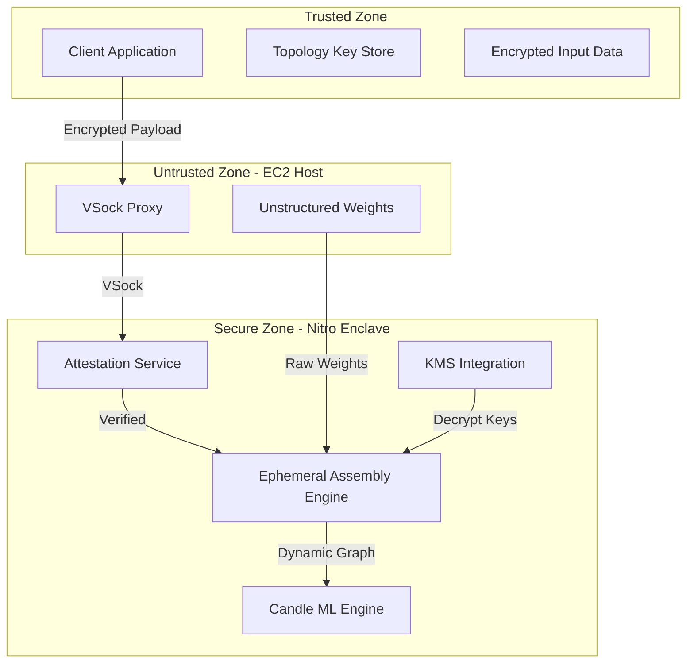

# Design Document: EphemeralML Zero-Trust AI Inference

## Overview

EphemeralML implements a novel "Ephemeral Topology Assembly" architecture that separates neural network models into two components: unstructured weights stored on untrusted cloud infrastructure and topology keys held by trusted clients. This design ensures that neither component alone reveals intellectual property, while enabling secure AI inference within AWS Nitro Enclaves.

The system operates on the principle that functional neural networks exist only during the milliseconds required for inference, making memory dumps and reverse engineering attacks mathematically useless. By leveraging AWS Nitro Enclaves' hardware-based isolation and attestation capabilities, the system provides strong security guarantees without the performance penalties of cryptographic approaches like Fully Homomorphic Encryption.

## Architecture

The system follows a three-zone security architecture:



### Security Zones

1. **Trusted Zone (Client)**: Maintains topology keys and encrypts sensitive data using KMS keys bound to enclave attestation
2. **Untrusted Zone (EC2 Host)**: Acts as an unprivileged proxy, storing only meaningless weight arrays
3. **Secure Zone (Nitro Enclave)**: Provides hardware-isolated execution environment with attestation capabilities

## Components and Interfaces

### Client Component

**Purpose**: Secure model decomposition and encrypted communication with enclaves

**Key Responsibilities**:
- ONNX model parsing and Candle compatibility validation (fail-fast on unsupported operators)
- Topology extraction and weight matrix serialization into unstructured arrays
- Topology key generation and secure storage
- Attestation verification and encrypted communication
- Input data encryption using enclave-bound KMS keys

**Interfaces**:
```rust
pub trait ModelDecomposer {
    fn decompose_model(&self, onnx_path: &Path) -> Result<(TopologyKey, WeightArrays), Error>;
    fn validate_onnx_compatibility(&self, model: &OnnxModel) -> Result<(), ValidationError>;
    fn check_candle_operator_support(&self, operators: &[String]) -> Result<(), UnsupportedOperatorError>;
}

pub trait SecureClient {
    fn establish_attested_channel(&mut self, enclave_endpoint: &str) -> Result<SecureChannel, Error>;
    fn encrypt_inference_request(&self, topology: &TopologyKey, data: &[f32]) -> Result<EncryptedPayload, Error>;
    fn verify_enclave_attestation(&self, attestation_doc: &[u8]) -> Result<bool, Error>;
}
```

### Host Proxy Component

**Purpose**: Unprivileged gateway between client and enclave

**Key Responsibilities**:
- VSock communication management
- Encrypted payload forwarding without inspection
- Weight storage and retrieval (unstructured arrays only)
- Connection lifecycle management

**Interfaces**:
```rust
pub trait VSockProxy {
    fn forward_to_enclave(&self, payload: &[u8]) -> Result<Vec<u8>, Error>;
    fn store_weights(&mut self, model_id: &str, weights: &[f32]) -> Result<(), Error>;
    fn retrieve_weights(&self, model_id: &str) -> Result<Vec<f32>, Error>;
}
```

### Enclave Assembly Engine

**Purpose**: Secure, ephemeral model construction and inference execution

**Key Responsibilities**:
- Attestation document generation and validation
- Topology key processing and graph construction
- Dynamic weight-to-node mapping
- Memory-safe model assembly using Candle framework
- Immediate model destruction after inference

**Interfaces**:
```rust
pub trait EphemeralAssembler {
    fn assemble_model(&mut self, topology: &TopologyKey, weights: &[f32]) -> Result<CandleModel, Error>;
    fn execute_inference(&self, model: &CandleModel, input: &Tensor) -> Result<Tensor, Error>;
    fn destroy_model(&mut self, model: CandleModel) -> Result<(), Error>;
    fn secure_memory_clear(&mut self) -> Result<(), Error>;
}

pub trait AttestationProvider {
    fn generate_attestation(&self, nonce: &[u8]) -> Result<AttestationDocument, Error>;
    fn get_pcr_measurements(&self) -> Result<PcrMeasurements, Error>;
}
```

## Data Models

### Topology Key Structure

The topology key contains the computational graph structure without weight values:

```rust
#[derive(Serialize, Deserialize, Clone)]
pub struct TopologyKey {
    pub graph_id: String,
    pub nodes: Vec<GraphNode>,
    pub edges: Vec<GraphEdge>,
    pub input_shapes: Vec<TensorShape>,
    pub output_shapes: Vec<TensorShape>,
    pub metadata: ModelMetadata,
}

#[derive(Serialize, Deserialize, Clone)]
pub struct GraphNode {
    pub node_id: String,
    pub operation: OperationType,
    pub parameters: HashMap<String, Value>,
    pub weight_indices: Vec<WeightIndex>, // References to weight positions
}

#[derive(Serialize, Deserialize, Clone)]
pub struct GraphEdge {
    pub from_node: String,
    pub to_node: String,
    pub tensor_shape: TensorShape,
}
```

### Weight Storage Format

Weights are stored as unstructured floating-point arrays with no architectural information:

```rust
#[derive(Serialize, Deserialize)]
pub struct WeightArrays {
    pub model_id: String,
    pub weight_data: Vec<f32>, // Flattened weight matrices
    pub checksum: u64,         // Integrity verification
}
```

### Secure Communication Protocol

```rust
#[derive(Serialize, Deserialize)]
pub struct InferenceRequest {
    pub topology_key: EncryptedTopologyKey,
    pub input_data: EncryptedTensor,
    pub model_id: String,
    pub nonce: [u8; 32],
}

#[derive(Serialize, Deserialize)]
pub struct InferenceResponse {
    pub result: EncryptedTensor,
    pub execution_time_ms: u64,
    pub attestation_proof: AttestationDocument,
}
```

### Attestation and Security Context

```rust
#[derive(Serialize, Deserialize)]
pub struct AttestationDocument {
    pub module_id: String,
    pub digest: [u8; 48],      // SHA384 of enclave image
    pub timestamp: u64,
    pub pcrs: PcrMeasurements,
    pub certificate: Vec<u8>,  // AWS-signed certificate
    pub signature: Vec<u8>,
}

#[derive(Serialize, Deserialize)]
pub struct PcrMeasurements {
    pub pcr0: [u8; 48], // Enclave image measurement
    pub pcr1: [u8; 48], // Linux kernel measurement  
    pub pcr2: [u8; 48], // Application measurement
}
```

## Implementation Architecture

### Model Decomposition Process

1. **ONNX Parsing**: Parse input ONNX model and validate operator compatibility with Candle
2. **Graph Extraction**: Extract computational graph structure (nodes, edges, operations)
3. **Weight Separation**: Extract all weight matrices and flatten into unstructured arrays
4. **Topology Serialization**: Serialize graph structure with weight index mappings
5. **Integrity Verification**: Generate checksums for both topology and weight components

### Ephemeral Assembly Process

1. **Attestation**: Generate and provide attestation document to client
2. **Secure Channel**: Establish encrypted communication using KMS keys bound to PCR measurements
3. **Topology Reception**: Receive and decrypt topology key within enclave
4. **Weight Retrieval**: Request unstructured weights from host storage
5. **Dynamic Assembly**: Construct Candle model by mapping weights to topology nodes
6. **Inference Execution**: Perform single inference pass
7. **Secure Destruction**: Overwrite model structure and clear sensitive memory regions

### Memory Security Implementation

```rust
impl Drop for EphemeralModel {
    fn drop(&mut self) {
        // Explicit memory clearing for security
        if let Some(ref mut weights) = self.weights {
            weights.iter_mut().for_each(|w| *w = 0.0);
        }
        if let Some(ref mut topology) = self.topology {
            topology.nodes.clear();
            topology.edges.clear();
        }
        
        // Force memory synchronization
        std::sync::atomic::fence(std::sync::atomic::Ordering::SeqCst);
    }
}
```

### VSock Communication Layer

The host proxy implements a simple forwarding mechanism:

```rust
pub struct VSockProxy {
    enclave_cid: u32,
    enclave_port: u32,
    weight_storage: HashMap<String, Vec<f32>>,
}

impl VSockProxy {
    pub async fn handle_client_request(&mut self, request: &[u8]) -> Result<Vec<u8>, Error> {
        // Forward encrypted payload to enclave without inspection
        let vsock_stream = VsockStream::connect(self.enclave_cid, self.enclave_port).await?;
        vsock_stream.write_all(request).await?;
        
        let mut response = Vec::new();
        vsock_stream.read_to_end(&mut response).await?;
        Ok(response)
    }
}
```

## Correctness Properties

*A property is a characteristic or behavior that should hold true across all valid executions of a system—essentially, a formal statement about what the system should do. Properties serve as the bridge between human-readable specifications and machine-verifiable correctness guarantees.*

### Property 1: Model Decomposition Separation
*For any* ONNX neural network model, decomposing it should produce unstructured weight arrays that contain no architectural information and topology keys that contain no weight values.
**Validates: Requirements 1.1, 1.2, 1.3, 1.4**

### Property 2: ONNX Compatibility Validation  
*For any* ONNX model, the system should accept it for decomposition if and only if all its operators are supported by the current Candle framework version.
**Validates: Requirements 1.5, 1.6**

### Property 3: Attestation Verification Integrity
*For any* attestation document, the client should establish a secure channel if and only if the attestation is valid, the PCR measurements match expected values, and the certificate chain is properly signed by AWS.
**Validates: Requirements 2.1, 2.4, 2.5**

### Property 4: Encryption Binding to Enclave Identity
*For any* input data encrypted by the client, it should be decryptable if and only if the decryption occurs within an enclave whose identity matches the KMS key binding.
**Validates: Requirements 2.2, 2.3**

### Property 5: Ephemeral Assembly Round-Trip
*For any* valid topology key and corresponding weight arrays, assembling them into a model and then immediately destroying the model should leave no recoverable model artifacts in memory.
**Validates: Requirements 3.1, 3.2, 3.3, 3.5**

### Property 6: Inference Isolation
*For any* inference operation, all computations should occur within the enclave boundary with no intermediate results, model structure, or sensitive data exposed to the host environment.
**Validates: Requirements 4.1, 4.2, 4.3, 4.5**

### Property 7: Encrypted Output Only
*For any* completed inference, the result returned to the client should be encrypted and contain no plaintext sensitive information.
**Validates: Requirements 4.4**

### Property 8: Host Proxy Transparency
*For any* encrypted payload, the host should forward it between client and enclave without modification, inspection, or persistent storage.
**Validates: Requirements 5.1, 5.3, 5.4**

### Property 9: Host Compromise Resilience
*For any* state of the host system, it should contain no functional models, topology keys, decryption keys, or plaintext sensitive data.
**Validates: Requirements 5.2, 5.5**

### Property 10: Memory Security Guarantees
*For any* model assembly and inference cycle, all memory locations containing model topology, weight mappings, and intermediate results should be securely overwritten upon completion.
**Validates: Requirements 6.1, 6.2, 6.3, 6.4**

### Property 11: Secure Error Handling
*For any* error condition (attestation failure, memory allocation failure, topology validation failure, communication error), the system should fail securely while maintaining all security boundaries and performing proper cleanup.
**Validates: Requirements 8.1, 8.2, 8.3, 8.4**

### Property 12: Diagnostic Information Security
*For any* diagnostic output or error message, it should contain no sensitive information that could reveal model structure, weights, topology, or input data.
**Validates: Requirements 8.5**

### Property 13: Comprehensive Audit Logging
*For any* security-relevant event (attestation, model assembly, inference, security violations), the system should generate immutable audit records with timestamps while ensuring no sensitive data is logged.
**Validates: Requirements 9.1, 9.2, 9.3, 9.4, 9.5**

### Property 14: Persistent Storage Prohibition
*For any* system component, no assembled models, topology-weight mappings, or decrypted sensitive data should be written to persistent storage.
**Validates: Requirements 3.4**

## Error Handling

The system implements defense-in-depth error handling with secure failure modes:

### Attestation Failures
- **Detection**: Invalid PCR measurements, expired certificates, or signature verification failures
- **Response**: Immediate session termination, audit logging, and client notification
- **Security**: No sensitive data transmission on attestation failure

### Memory Allocation Failures  
- **Detection**: Insufficient memory for model assembly or inference operations
- **Response**: Graceful degradation with partial model cleanup before failure
- **Security**: Secure memory clearing of any partially assembled components

### Communication Errors
- **Detection**: VSock connection failures, timeout conditions, or malformed payloads
- **Response**: Connection reset with security boundary maintenance
- **Security**: No sensitive data exposure during error recovery

### Topology Validation Failures
- **Detection**: Invalid graph structure, unsupported operators, or corrupted topology keys
- **Response**: Request rejection with descriptive error codes
- **Security**: No topology key information leaked in error messages

### Enclave Resource Exhaustion
- **Detection**: CPU, memory, or time limit exceeded during inference
- **Response**: Controlled termination with complete model destruction
- **Security**: Secure cleanup of all sensitive materials before termination

## Testing Strategy

The testing approach combines unit testing for specific scenarios with property-based testing for comprehensive correctness validation.

### Unit Testing Focus Areas

**Integration Points**:
- VSock communication between host and enclave
- KMS integration for encryption/decryption operations  
- ONNX model parsing and validation
- Candle framework integration

**Edge Cases**:
- Empty or malformed ONNX models
- Network communication failures
- Memory pressure scenarios
- Invalid attestation documents

**Security Scenarios**:
- Attestation bypass attempts
- Memory dump simulation
- Host compromise scenarios
- Timing attack resistance

### Property-Based Testing Configuration

**Framework**: Use `proptest` crate for Rust property-based testing
**Test Iterations**: Minimum 100 iterations per property test
**Generator Strategy**: Smart generators that create valid ONNX models, topology keys, and weight arrays within realistic constraints

**Property Test Implementation Requirements**:
- Each correctness property must be implemented as a single property-based test
- Tests must run with minimum 100 iterations due to randomization
- Each test must be tagged with format: **Feature: ephemeral-inference, Property {number}: {property_text}**
- Tests should use realistic data generators that respect domain constraints
- Property tests must validate universal correctness across all valid inputs

**Test Data Generation**:
- **ONNX Models**: Generate models with varying architectures using only Candle-supported operators
- **Topology Keys**: Create valid computation graphs with different complexity levels
- **Weight Arrays**: Generate realistic weight distributions for different model sizes
- **Attestation Documents**: Create both valid and invalid attestation scenarios
- **Input Data**: Generate tensors with various shapes and value ranges

### Security Testing Requirements

**Memory Analysis**:
- Verify secure memory clearing using memory inspection tools
- Test resistance to cold-boot attacks through memory dump analysis
- Validate that no model artifacts persist after inference completion

**Attestation Testing**:
- Test with valid and invalid PCR measurements
- Verify certificate chain validation
- Test attestation document tampering detection

**Isolation Verification**:
- Confirm no data leakage between security zones
- Verify host cannot access enclave memory or computations
- Test that compromised host reveals no sensitive information

The dual testing approach ensures both specific correctness (unit tests) and universal properties (property-based tests) are validated, providing comprehensive coverage of the system's security and functional requirements.