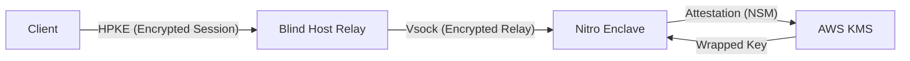

# 🔒 EphemeralML: Confidential Inference Gateway

> **High-assurance confidential inference with verifiable execution receipts**  
> Run sensitive AI inference where model weights and prompts stay protected, even if the host is compromised.

EphemeralML is a **Confidential Inference Gateway** designed for AWS Nitro Enclaves with:
- **Attestation-gated key release** + **HPKE encrypted sessions** + **audit receipts**
- **Host acts as blind relay** - cannot decrypt prompts, outputs, or model keys
- **Built for regulated and high-assurance environments** (government clouds, defense contractors, critical infrastructure)

**🚀 Current Status**: **Live Beta**. Validated on AWS Nitro Enclaves. The system now supports end-to-end confidential inference with real NSM attestation and KMS integration.

---

## 🎯 High-Assurance Confidential Inference

EphemeralML is purpose-built for **regulated industries** (Defense, Government, Finance, Healthcare) that require:
- **Confidentiality**: Even with root access on the host, model weights and user prompts are never visible in plaintext.
- **Verifiability**: Every inference produces a cryptographic receipt proving exactly what code executed.
- **Compliance**: Hardware-rooted attestation meets the strictest requirements for data protection in the cloud.

We focus on **High-Assurance CPU-based Inference** (MiniLM, BERT, and other transformer architectures) where security is the primary requirement.

---

## 🏗️ Architecture: The Secure Inference Gateway

EphemeralML implements a four-tier trust model that ensures secrets never leave a trusted environment.

### The Chain of Trust:
1.  **Client**: Initiates an encrypted session directly to the Enclave using HPKE. The Client verifies the Enclave's **Attestation Document** before sending any data.
2.  **Blind Host**: Acts as a simple networking and storage relay. It manages VSock connections and S3 downloads but **never possesses the keys** to decrypt the traffic or the model.
3.  **Nitro Enclave**: The isolated compute environment. It requests a cryptographic challenge from the **Nitro Security Module (NSM)** to prove its identity.
4.  **AWS KMS**: Releases the model's Data Encryption Key (DEK) **only** if the Enclave's attestation (PCRs) matches the pre-defined security policy.

---

## 🛡️ What EphemeralML Protects

EphemeralML is a **Confidential Inference Gateway** that protects:

| **Model weights (IP)** | **User inputs/outputs (PII / classified)** | **Execution integrity (verified code)** |
|------------------------|---------------------------------------------|------------------------------------------|

It does this with a **two-part foundation**:
- **TEE isolation** (Nitro Enclave) for trusted operations
- **Attestation-bound cryptography** so secrets are released only to approved enclave measurements

---

## 🔄 How It Works (3 Steps)

### 1️⃣ Verify the enclave (Attestation)
The client verifies the enclave identity + code measurement against an allowlist using the AWS Nitro attestation document.

### 2️⃣ Establish encrypted session (HPKE)  
All requests and responses are encrypted to the enclave. The host forwards ciphertext only.

### 3️⃣ Load models with gated keys (KMS)
Model keys are released using an **RSA-2048 SPKI DER** handshake via NSM. KMS confirms the enclave measurement matches policy before releasing the DEK.

---

## ✅ Security Guarantees

### Architecture provides:
- ✓ **Host blindness**: the host relays encrypted traffic but cannot decrypt prompts, outputs, or model keys
- ✓ **Attestation-gated key release**: model DEKs released only to approved enclave measurements  
- ✓ **Session binding**: encryption keys bound to attestation + nonce to prevent key swapping
- ✓ **Anti-swap model integrity**: signed model manifests prevent serving different model blobs
- ✓ **Auditability**: each inference produces an Attested Execution Receipt (AER) clients can verify

---

## 🧾 Attested Execution Receipts (AER)

Each inference returns an **AER** containing:
- Enclave measurements + attestation hash
- Request/response hashes  
- Policy version + security mode
- Monotonic sequence + signature

**This enables:**
- 📋 **Audit-ready evidence**
- 🔍 **Incident investigation** without storing plaintext prompts
- 🔐 **"What code processed this?"** answered cryptographically

---

## 👥 Product-Market Fit: Regulated Industries

### High-Assurance AI
For organizations where "good enough" security isn't enough. We enable:
- **Defense & GovCloud**: Deploying LLMs and BERT-style models on sensitive data.
- **Financial Services**: Private credit scoring and PII-heavy analysis.
- **Critical Infrastructure**: Secure edge inference for industrial controls.

### Technical Focus
- **Architecture**: Optimized for CPU-based inference (Nitro Enclaves).
- **Models**: High-performance support for MiniLM, BERT, and quantized GGUF models.
- **Hardware**: Rooted in AWS Nitro Security Module (NSM).

---

## 🚀 Implementation Status

### ✅ Production Ready: AWS & Nitro Features

**Real Security Implementation:**
- [x] **Real NSM Support**: Enclave integrates with the Nitro Security Module (NSM) for hardware-rooted attestation.
- [x] **Production KMS Handshake**: Implemented RSA-2048 SPKI DER key exchange via NSM for secure key release.
- [x] **VSock Communication**: High-performance, secure communication between host and enclave.
- [x] **Infrastructure as Code**: Terraform setup ready in `projects/EphemeralML/infra` for automated AWS deployment.
- [x] **Model Protection**: `encrypt_model.py` and `setup_host.sh` scripts for production workflow.

### ✅ Completed Components

**Core Infrastructure**
- **Production Candle-based inference engine for transformer models**
  - Support for MiniLM-L6-v2 (BERT) and Llama-like architectures
  - **GGUF support** for quantized models (int4, int8, etc.)
  - Optimized for memory-efficient inference in TEE environments

**Cryptographic Primitives**
- HPKE session management with production-grade encryption (ChaCha20-Poly1305)
- Ed25519 receipt signing with canonical encoding
- Real NSM attestation verification framework

---

## 🛠️ Getting Started

### Nitro Enclave deployment (AWS)
- Region: `us-east-1`
- Instance type: `m6i.xlarge` (Enclave enabled)
- See: `projects/EphemeralML/infra/hello-enclave/HELLO_ENCLAVE_RUNBOOK.md` for the minimal deployment loop.

---

## 📄 License

Apache License 2.0 — see `LICENSE` file for details.

---

**🔒 Confidential inference with cryptographic proof**  
**🛡️ Run inference like the host is already hacked**  
**🔐 Attestation-gated model access + end-to-end encrypted prompts**

*Live Beta: Validated on AWS Nitro Enclaves*

**[View Progress](docs/tasks.md)** • **[Read Specification](docs/design.md)**

