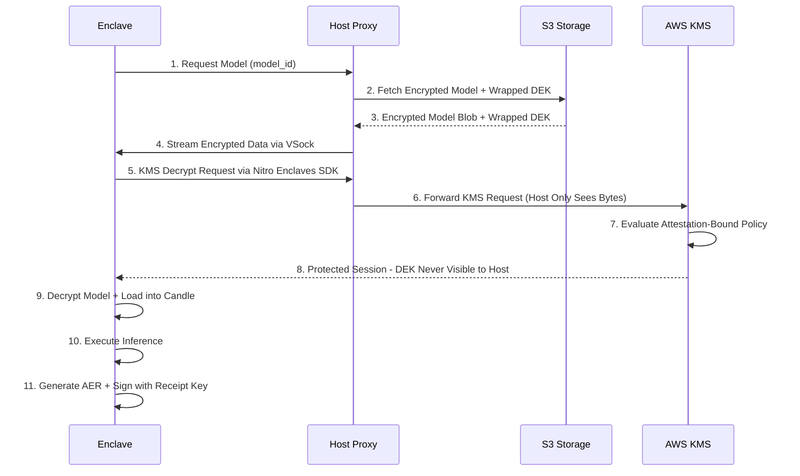

# Design Document: Confidential Inference Gateway

## Overview

The Confidential Inference Gateway implements a defense-in-depth architecture for protecting model weights and sensitive user inputs during AI inference. The system operates on Layer 1 (Gateway) security providing TEE isolation with attestation-gated key release and end-to-end encrypted sessions using HPKE. 

**Shield Mode (Layer 2) is future scope for v1**: In v1, Shield Mode interfaces and policy hooks exist, but no obfuscation is executed; all Shield Mode logic is inactive and reserved for v2.

The architecture follows the principle that the host acts as a blind relay, handling only encrypted data while all sensitive operations occur within the AWS Nitro Enclave's trusted boundary. All AWS API access is mediated through VSock proxies with proper credential management, ensuring the enclave never directly accesses external networks while maintaining cryptographic isolation.

## Architecture

The system implements a three-zone security architecture with clear trust boundaries:

```mermaid
graph TB
    subgraph "Client Zone (Trusted)"
        C[Client Application]
        V[Attestation Verifier]
        E2E[E2E Session Manager]
        AL[Measurement Allowlist]
        C --> V --> E2E
        V --> AL
    end
    
    subgraph "Host Zone (Untrusted Relay)"
        HP[Host Proxy]
        VP[VSock Proxy]
        KP[KMS Proxy]
        S3P[S3 Proxy]
        S3[Encrypted Model Storage]
        HP --> VP
        HP --> KP --> AWS_KMS[AWS KMS]
        HP --> S3P --> S3
    end
    
    subgraph "Enclave Zone (Trusted Compute)"
        NSM[Nitro Security Module]
        AD[Attestation Document Generator]
        KMS[KMS Client via VSock]
        SM[Session Manager]
        ML[Model Loader]
        IE[Inference Engine]
        AER[Receipt Generator]
        
        NSM --> AD
        AD --> SM
        KMS --> ML
        ML --> IE
        IE --> AER
    end

## Communication Flows

### Flow A: Attestation and HPKE Session Establishment

```mermaid
sequenceDiagram
    participant C as Client
    participant H as Host Proxy
    participant E as Enclave
    participant NSM as Nitro Security Module

    C->>H: 1. Attestation Challenge + Nonce
    H->>E: Forward Challenge
    E->>NSM: Generate Attestation Document
    E->>E: Generate HPKE + Receipt Keys
    NSM-->>E: Attestation Document
    E->>E: Embed Keys in User Data
    E->>H: 2. Attestation Doc + Keys
    H->>C: Forward Attestation Response
    C->>C: Verify Attestation + Extract Keys
    C->>H: 3. HPKE Encrypted Session Request
    H->>E: Forward via VSock
    E->>H: 4. HPKE Encrypted Session Response
    H->>C: Forward Response
```

### Flow B: Model Loading and Inference



    style C fill:#4ecdc4
    style HP fill:#45b7d1
    style NSM fill:#ff6b6b
    style SHIELD fill:#ffa726
```

### Security Zones

1. **Client Zone (Trusted)**: Maintains measurement allowlists, verifies attestation, establishes HPKE sessions, and manages policy updates
2. **Host Zone (Untrusted Relay)**: Provides networking, storage, and AWS API proxy services without accessing plaintext DEKs
3. **Enclave Zone (Trusted Compute)**: Performs all sensitive operations within hardware-isolated environment using VSock-mediated AWS access

## AWS Credentials and SigV4 Signing

### KMS Authorization Model

**Attestation-Bound Key Release Policy (Hardened Production Mode)**:
The system has transitioned from permissive/mock mode to a hardened production-ready architecture. The security of the system depends on KMS key policies that cryptographically bind key release to enclave attestation.

**KMS RecipientInfo Implementation**:
We utilize the `public_key` field within the NSM attestation document to provide an RSA-2048 public key generated inside the enclave. AWS KMS uses this key to wrap the Data Encryption Key (DEK) specifically for the requesting enclave instance. This ensures that even if the host intercepts the KMS response, it cannot decrypt the wrapped secret.

**Required KMS Policy Structure**:
```json
{
  "Version": "2012-10-17",
  "Statement": [
    {
      "Effect": "Allow",
      "Principal": {"AWS": "arn:aws:iam::ACCOUNT:role/NitroEnclaveRole"},
      "Action": "kms:Decrypt",
      "Resource": "*",
      "Condition": {
        "StringEquals": {
          "kms:RecipientAttestation:ImageSha384": "APPROVED_ENCLAVE_MEASUREMENT"
        }
      }
    }
  ]
}
```

**Authorization Flow**:
1. Enclave generates an RSA-2048 keypair.
2. Enclave requests an attestation document from NSM, embedding the RSA public key in the `public_key` field.
3. Enclave calls `kms:Decrypt` (via VSock proxy) providing the attestation document as `RecipientInfo`.
4. **KMS evaluates policy**: KMS validates the attestation document (checking measurements like `kms:RecipientAttestation:ImageSha384`).
5. **Key Wrapping**: KMS wraps the plaintext DEK using the RSA public key provided in the attestation document.
6. **Protected Delivery**: The host only forwards the RSA-wrapped bytes to the enclave. Only the enclave, possessing the private RSA key, can decrypt the DEK.

**Authorization Model Clarification**:
KMS enforces cryptographic eligibility for DEK release; semantic authorization (which model, which client, which session) is enforced by signed policy bundles and client-side verification.

**V1 Security Limitation**:
If an attacker compromises the host and steals IAM credentials, they can make arbitrary AWS API calls. However, the KMS policy prevents DEK decryption without valid enclave attestation. The limitation is that the attacker could potentially DoS the service or access other AWS resources not protected by attestation-bound policies.

### Credential Management Strategy

The system implements **Approach 1** for v1 with documented limitations:

**Host-Based Credential Management (v1)**:
- Host retrieves short-lived IAM role credentials via EC2 instance profile
- Host performs SigV4 signing for AWS API requests on behalf of enclave
- **Limitation**: Compromised host can steal these credentials during their validity period
- **Mitigation**: Use shortest possible credential lifetime (15 minutes) and monitor for anomalous usage

**Future Enhancement (v2)**:
- Implement credential broker that releases short-lived credentials only over attested channels
- Enclave performs its own SigV4 signing with credentials never visible to host

### Request Flow with Credential Handling

```rust
pub struct AWSCredentialProxy {
    role_arn: String,
    session_duration: Duration, // 15 minutes max
    credential_cache: Option<Credentials>,
}

impl AWSCredentialProxy {
    pub fn sign_request(&self, request: &HttpRequest) -> Result<SignedRequest, CredentialError> {
        let creds = self.get_fresh_credentials()?;
        // Host performs SigV4 signing
        aws_sigv4::sign_request(request, &creds)
    }
    
    // Enclave validates all responses as untrusted
    pub fn validate_response(&self, response: &[u8]) -> Result<(), ValidationError> {
        // Verify response format, size limits, expected structure
        // Treat all host-provided data as potentially malicious
    }
}
```

## Protocol Version Negotiation

### Handshake Protocol

```rust
#[derive(Serialize, Deserialize)]
pub struct ClientHello {
    pub version: u32,                   // Fixed to 1 for v1
    pub supported_features: Vec<String>,
    pub client_nonce: [u8; 32],
}

#[derive(Serialize, Deserialize)]
pub struct ServerHello {
    pub version: u32,                   // Fixed to 1 for v1
    pub chosen_features: Vec<String>,
    pub attestation_document: Vec<u8>,
    pub ephemeral_public_key: Vec<u8>,
}
```

### Negotiation Flow

1. **Client Hello**: Client sends version 1 and supported features
2. **Server Hello**: Enclave responds with version 1, attestation document, and ephemeral key
3. **Version Binding**: Protocol version 1 is included in all subsequent AER receipts
4. **Feature Negotiation**: Both parties agree on optional features (extended receipts, etc.)

**Note**: Version negotiation is reserved for v2. V1 uses fixed version 1 only.

## V1 Model Scope and Performance Envelope

### Supported Model Classes (v1)

**In Scope**:
- Llama-3-8B model family (BF16 dtype only)
- Embedding models (sentence transformers, etc.)
- Classification models (BERT-base, DistilBERT)
- Lightweight vision models (MobileNet, EfficientNet-small)
- Models up to 1B parameters with heavy quantization within memory constraints

**Performance Targets**:
- Models up to 2GB memory footprint (conservative for Nitro CPU constraints)
- Inference latency: 200ms - 10s depending on model and input size
- Throughput: 1-5 requests/second for concurrent sessions
- Cold start: < 60 seconds including attestation and model loading

**Out of Scope (v1)**:
- Large language models (> 1B parameters)
- Real-time interactive chat applications (< 200ms latency)
- High-throughput batch inference
- GPU-accelerated inference (future v2 with confidential GPU support)

### Resource Constraints

```rust
pub struct EnclaveResourceLimits {
    pub max_memory_mb: u64,        // 8GB typical Nitro limit
    pub max_model_size_mb: u64,    // 2GB for model + overhead (conservative)
    pub max_concurrent_sessions: u32, // 4-8 depending on model size
    pub session_timeout_minutes: u32, // 15 minutes max
}
```

## VSock Communication Protocol

### Message Framing and Limits

```rust
#[derive(Debug)]
pub struct VSockMessage {
    pub length: u32,           // Message length (max 16MB)
    pub message_type: u8,      // Request/Response/Error
    pub sequence: u32,         // For ordering and replay detection
    pub payload: Vec<u8>,      // Actual message content
}

pub struct VSockLimits {
    pub max_message_size: usize,    // 16MB
    pub max_concurrent_streams: u32, // 16
    pub read_timeout_ms: u64,       // 30 seconds
    pub write_timeout_ms: u64,      // 30 seconds
}
```

### DoS Protection

```rust
impl VSockServer {
    async fn handle_message(&self, stream: &mut VsockStream) -> Result<(), VSockError> {
        // Read length-prefixed message with timeout
        let length = timeout(Duration::from_millis(30000), stream.read_u32()).await??;
        
        if length > MAX_MESSAGE_SIZE {
            return Err(VSockError::MessageTooLarge);
        }
        
        let mut buffer = vec![0u8; length as usize];
        timeout(Duration::from_millis(30000), stream.read_exact(&mut buffer)).await??;
        
        // Process message with backpressure
        self.process_with_backpressure(buffer).await
    }
}
```

## Receipt Key Management

### Separate Ephemeral Keys for Different Purposes

**Key Generation**:
- **HPKE KEM Key**: X25519 keypair for HPKE key encapsulation
- **Receipt Signing Key**: Ed25519 keypair for AER signature generation
- Both keys are generated inside the enclave at session establishment
- Both public keys are embedded in attestation document user data

**Attestation Document User Data Structure**:
```rust
#[derive(Serialize, Deserialize)]
pub struct AttestationUserData {
    pub hpke_public_key: [u8; 32],      // X25519 public key for HPKE
    pub receipt_signing_key: [u8; 32],  // Ed25519 public key for receipts
    pub protocol_version: u32,          // Fixed to 1 for v1
    pub supported_features: Vec<String>,
}
```

**Key Binding Specification**:
- Both HPKE and receipt keys are embedded only in attestation document user data
- The NSM public_key field is treated as unused/reserved
- Session keys are bound to hash(attestation_doc) and parsed user-data keys
- Canonical transcript hash: attestation_doc_hash || user_data_hash || client_nonce || protocol_version
- **Design Constraint**: Attestation user_data SHALL be ≤ 1KB and versioned. Feature negotiation MUST NOT rely on expanding user_data in v1

### Precise Key Binding Specification

**Receipt Verification Process**:
1. Client extracts `receipt_signing_key` from attestation document user data
2. Client verifies receipt signature using the extracted Ed25519 public key
3. Receipt authenticity is proven by the binding to the attested enclave instance
4. **Trust Anchor**: The only trust anchor for receipt verification is the attestation document validated against AWS Nitro roots and client allowlists

```rust
pub struct ReceiptBinding {
    pub hpke_public_key: [u8; 32],        // For HPKE session establishment
    pub receipt_signing_key: [u8; 32],    // For AER signature verification
    pub attestation_hash: [u8; 32],       // Binds to specific attestation document
    pub session_id: SessionId,            // Links receipt to specific session
}

impl ReceiptVerifier {
    pub fn verify_receipt(&self, receipt: &AttestationReceipt, attestation_doc: &AttestationDocument) -> Result<bool, VerificationError> {
        // Extract receipt signing key from attestation document user data
        let user_data: AttestationUserData = self.parse_user_data(attestation_doc)?;
        
        // Verify receipt signature using the Ed25519 key
        self.verify_ed25519_signature(&receipt.signature, &receipt.canonical_encoding(), &user_data.receipt_signing_key)
    }
}
```

## Freshness and Replay Protection

### Client-Side Freshness Tracking

**Nonce Management**:
- Client generates and tracks nonces for attestation challenges
- Client maintains nonce history to detect replay attempts
- KMS policy evaluation includes attestation validation but NOT freshness tracking
- Freshness is enforced by client verifier and optional key broker

```rust
pub struct FreshnessTracker {
    used_nonces: LruCache<[u8; 32], SystemTime>,  // Bounded LRU cache
    max_nonce_age: Duration, // 5 minutes
    max_entries: usize,      // 50,000 entries max
}

impl FreshnessTracker {
    pub fn validate_freshness(&mut self, nonce: &[u8; 32]) -> Result<(), FreshnessError> {
        // Check if nonce was recently used
        if let Some(timestamp) = self.used_nonces.get(nonce) {
            return Err(FreshnessError::NonceReused);
        }
        
        // Check capacity and fail closed if over limit
        if self.used_nonces.len() >= self.max_entries {
            return Err(FreshnessError::CapacityExceeded);
        }
        
        // Add to tracking with TTL
        let now = SystemTime::now();
        self.used_nonces.put(*nonce, now);
        
        Ok(())
    }
    
    pub fn cleanup_expired(&mut self) {
        let now = SystemTime::now();
        self.used_nonces.retain(|_, timestamp| {
            now.duration_since(*timestamp).unwrap_or(Duration::MAX) < self.max_nonce_age
        });
    }
}
```

### Client Components

#### Attestation Verifier
**Purpose**: Verify enclave identity and establish trust before releasing secrets using hardened production verification.

**Key Responsibilities**:
- **Full COSE/CBOR Parsing**: Perform deep inspection of the Nitro attestation document structure.
- **Hardened Certificate Validation**: Validate the full AWS certificate chain (Leaf -> Intermediate -> Root CA).
- **Measurement Validation**: Check enclave measurements against client-maintained allowlists.
- **Freshness Enforcement**: Enforce freshness through nonce-based challenge-response.
- **HPKE Binding**: Establish HPKE sessions bound to attested ephemeral public keys.

**Interface**:
```rust
pub trait AttestationVerifier {
    fn verify_attestation(&self, doc: &AttestationDocument, nonce: &[u8]) -> Result<EnclaveIdentity, AttestationError>;
    fn check_measurement_allowlist(&self, measurements: &EnclaveMeasurements) -> Result<(), PolicyError>;
    fn validate_certificate_chain(&self, cert_chain: &[u8]) -> Result<(), CertificateError>;
    fn extract_public_key(&self, doc: &AttestationDocument) -> Result<PublicKey, CryptoError>;
}

#[derive(Debug, Clone)]
pub struct AttestationDocument {
    pub module_id: String,
    pub digest: [u8; 48],
    pub timestamp: u64,
    pub pcrs: EnclaveMeasurements,
    pub certificate: Vec<u8>,
    pub public_key: Option<Vec<u8>>,
    pub user_data: Option<Vec<u8>>,
    pub nonce: Option<Vec<u8>>,
}

#[derive(Debug, Clone)]
pub struct EnclaveMeasurements {
    pub pcr0: [u8; 48], // Enclave image measurement
    pub pcr1: [u8; 48], // Linux kernel measurement  
    pub pcr2: [u8; 48], // Application measurement
    pub pcr8: Option<[u8; 48]>, // Additional measurements
}
```

#### HPKE Session Manager
**Purpose**: Establish and manage HPKE encrypted communication sessions bound to enclave attestation

**Key Responsibilities**:
- Implement HPKE (v1) handshake with attestation binding
- Derive session keys from verified enclave ephemeral public keys
- Implement authenticated encryption with replay protection
- Manage session lifecycle with automatic expiration and policy updates

**Interface**:
```rust
pub trait HPKESessionManager {
    fn establish_hpke_session(&mut self, enclave_key: &PublicKey, attestation_hash: &[u8], protocol_version: u32) -> Result<SessionId, SessionError>;
    fn encrypt_payload(&self, session_id: &SessionId, data: &[u8], sequence_number: u64) -> Result<EncryptedPayload, CryptoError>;
    fn decrypt_response(&self, session_id: &SessionId, ciphertext: &[u8]) -> Result<Vec<u8>, CryptoError>;
    fn terminate_session(&mut self, session_id: &SessionId) -> Result<(), SessionError>;
    fn update_policy(&mut self, signed_policy_bundle: &[u8]) -> Result<(), PolicyError>;
}

#[derive(Debug, Clone)]
pub struct EncryptedPayload {
    pub session_id: SessionId,
    pub protocol_version: u32,
    pub sequence_number: u64,
    pub ciphertext: Vec<u8>,
    pub auth_tag: [u8; 16],
}
```

### Host Components

#### Host Proxy with AWS API Mediation
**Purpose**: Provide blind relay services and AWS API proxy without accessing plaintext DEKs

**Key Responsibilities**:
- Forward encrypted payloads without inspection or modification
- Manage VSock connections to enclave
- Provide AWS API proxy for KMS and S3 without terminating E2E encryption
- Maintain no persistent state of sensitive communications or plaintext DEKs

**Interface**:
```rust
pub trait HostProxy {
    fn forward_to_enclave(&self, payload: &[u8]) -> Result<Vec<u8>, ProxyError>;
    fn proxy_kms_request(&self, encrypted_request: &[u8]) -> Result<Vec<u8>, ProxyError>;
    fn proxy_s3_request(&self, encrypted_request: &[u8]) -> Result<Vec<u8>, ProxyError>;
    fn health_check(&self) -> Result<ProxyStatus, ProxyError>;
}

pub struct AWSProxyConfig {
    pub kms_endpoint: String,
    pub s3_endpoint: String,
    pub max_request_size: usize,
    pub timeout_ms: u64,
}
```

### Enclave Components

#### Attestation Document Generator
**Purpose**: Generate cryptographically signed proof of enclave identity

**Key Responsibilities**:
- Interface with AWS Nitro Security Module (NSM)
- Generate attestation documents with current measurements and ephemeral public keys
- Include session public keys in attestation user data for binding
- Respond to freshness challenges with nonces

**Interface**:
```rust
pub trait AttestationProvider {
    fn generate_attestation(&self, nonce: Option<&[u8]>, user_data: Option<&[u8]>) -> Result<AttestationDocument, NSMError>;
    fn get_measurements(&self) -> Result<EnclaveMeasurements, NSMError>;
    fn describe_pcrs(&self) -> Result<PcrDescriptions, NSMError>;
}

// NSM API integration
pub struct NSMClient {
    fd: i32,
}

impl NSMClient {
    pub fn new() -> Result<Self, NSMError>;
    pub fn attestation_doc(&self, nonce: Option<&[u8]>, user_data: Option<&[u8]>, public_key: Option<&[u8]>) -> Result<Vec<u8>, NSMError>;
}
```

#### Session Manager (Enclave Side)
**Purpose**: Manage encrypted sessions and decrypt client payloads within enclave

**Key Responsibilities**:
- Generate ephemeral keypairs for session establishment
- Decrypt client payloads using session keys
- Enforce session timeouts and isolation
- Securely destroy session material on termination

**Interface**:
```rust
pub trait EnclaveSessionManager {
    fn create_session(&mut self, protocol_version: u32) -> Result<(SessionId, PublicKey), SessionError>;
    fn decrypt_payload(&self, session_id: &SessionId, payload: &EncryptedPayload) -> Result<InferenceRequest, CryptoError>;
    fn encrypt_response(&self, session_id: &SessionId, response: &InferenceResponse) -> Result<EncryptedPayload, CryptoError>;
    fn cleanup_session(&mut self, session_id: &SessionId) -> Result<(), SessionError>;
}

#[derive(Debug)]
pub struct InferenceRequest {
    pub model_id: String,
    pub input_data: Vec<f32>,
    pub parameters: InferenceParameters,
    pub request_hash: [u8; 32],
}

#[derive(Debug)]
pub struct InferenceResponse {
    pub output_data: Vec<f32>,
    pub execution_time_ms: u64,
    pub receipt: Option<AttestationReceipt>,
}
```

#### Model Loader and KMS Integration via VSock
**Purpose**: Securely load and decrypt models using attestation-gated DEKs via host proxy

**Key Responsibilities**:
- Request encrypted models from host via VSock proxy
- Decrypt models using KMS DEKs via VSock-mediated KMS proxy
- Load models into Candle framework for inference
- Implement secure memory management with explicit zeroization
- Validate all responses from untrusted host proxy

**Interface**:
```rust
pub trait ModelLoader {
    fn load_model(&mut self, model_id: &str) -> Result<LoadedModel, ModelError>;
    fn decrypt_model_dek(&self, encrypted_dek: &[u8]) -> Result<Vec<u8>, KMSError>;
    fn validate_proxy_response(&self, response: &[u8]) -> Result<(), ValidationError>;
    fn unload_model(&mut self, model_id: &str) -> Result<(), ModelError>;
}

pub struct LoadedModel {
    pub model_id: String,
    pub candle_model: candle_core::Module,
    pub metadata: ModelMetadata,
}

// KMS integration via VSock proxy - enclave treats responses as untrusted
pub trait KMSClient {
    fn decrypt_via_proxy(&self, encrypted_dek: &[u8], encryption_context: &HashMap<String, String>) -> Result<Vec<u8>, KMSError>;
    fn validate_kms_response(&self, response: &[u8]) -> Result<(), ValidationError>;
}
```

#### Inference Engine
**Purpose**: Execute ML inference within the trusted boundary

**Key Responsibilities**:
- Perform inference using Candle ML framework with safetensors format
- Ensure no intermediate results leak to host
- Generate execution receipts with per-session ephemeral signing keys

**Interface**:
```rust
pub trait InferenceEngine {
    fn execute_inference(&self, model: &LoadedModel, input: &[f32], params: &InferenceParameters) -> Result<InferenceOutput, InferenceError>;
}

#[derive(Debug)]
pub struct InferenceOutput {
    pub output_data: Vec<f32>,
    pub execution_time_ms: u64,
    pub memory_peak_mb: u64,
}

#[derive(Debug)]
pub struct InferenceParameters {
    pub max_tokens: Option<usize>,
    pub temperature: Option<f32>,
    pub top_p: Option<f32>,
}
```

## Data Models

**Canonical Encoding Standard**: All canonical encodings use deterministic CBOR (RFC 8949, canonical mode) with sorted map keys.

### Freshness and Replay Protection Mechanisms

| Mechanism | Scope | Purpose |
|-----------|-------|---------|
| Attestation nonce | Handshake | Prevent replay of attestation |
| Session sequence | Session | Prevent replay of messages |
| Request nonce | Per request | Bind AER to specific request |

### Protocol Messages

```rust
#[derive(Serialize, Deserialize, Debug)]
pub struct AttestationChallenge {
    pub nonce: [u8; 32],
    pub protocol_version: u32,
    pub client_id: String,
    pub timestamp: u64,
}

#[derive(Serialize, Deserialize, Debug)]
pub struct AttestationResponse {
    pub attestation_document: Vec<u8>, // CBOR-encoded
    pub session_public_key: Vec<u8>,
    pub protocol_version: u32,
    pub supported_features: Vec<String>,
}

#[derive(Serialize, Deserialize, Debug)]
pub struct SessionEstablishment {
    pub session_id: SessionId,
    pub encrypted_session_key: Vec<u8>,
    pub key_exchange_proof: Vec<u8>,
}

#[derive(Serialize, Deserialize, Debug)]
pub struct InferenceRequestMessage {
    pub model_id: String,
    pub input_data: Vec<u8>, // Encrypted tensor data
    pub parameters: InferenceParameters,
    pub request_nonce: [u8; 16],
}

#[derive(Serialize, Deserialize, Debug)]
pub struct InferenceResponseMessage {
    pub output_data: Vec<u8>, // Encrypted tensor data
    pub execution_metadata: ExecutionMetadata,
    pub receipt: Option<AttestationReceipt>,
}
```

### Attestation and Receipts

```rust
#[derive(Serialize, Deserialize, Debug)]
pub struct AttestationReceipt {
    pub receipt_id: String,
    pub enclave_measurements: EnclaveMeasurements,
    pub request_hash: [u8; 32],
    pub execution_timestamp: u64,
    pub security_mode: SecurityMode,
    pub signature: Vec<u8>,
    pub signing_key_proof: Vec<u8>,
}

#[derive(Serialize, Deserialize, Debug)]
pub enum SecurityMode {
    GatewayOnly,
    // Shield Mode reserved for v2
}

#[derive(Serialize, Deserialize, Debug)]
pub struct ExecutionMetadata {
    pub execution_time_ms: u64,
    pub memory_peak_mb: u64,
    pub model_version: String,
    pub enclave_version: String,
    pub security_mode: SecurityMode,
}
```

## Implementation Architecture

### Attestation Flow with Ephemeral Key Binding

1. **Challenge Generation**: Client generates cryptographic nonce and sends attestation challenge
2. **Ephemeral Key Generation**: Enclave generates ephemeral HPKE keypair for session
3. **Document Generation**: Enclave uses NSM API to generate attestation document with measurements and ephemeral public key in user data
4. **Verification**: Client validates certificate chain, measurements against allowlist, and freshness
5. **HPKE Session Establishment**: Client establishes HPKE session bound to attestation hash and ephemeral key
6. **Binding**: All subsequent communications use session keys cryptographically bound to attestation

### Key Release and Model Loading via VSock Proxy

1. **Policy Evaluation**: KMS evaluates key release policy against enclave attestation using kms:RecipientAttestation:* condition keys
2. **Encrypted Retrieval**: Host retrieves encrypted model and wrapped DEKs from S3 storage
3. **VSock Transfer**: Host streams encrypted model and DEKs to enclave via VSock
4. **DEK Decryption**: Enclave calls kms-decrypt via Nitro Enclaves SDK; host only forwards bytes and never sees plaintext DEKs
5. **Model Decryption**: Enclave decrypts model using DEKs within trusted boundary
6. **Loading**: Safetensors format parsed and loaded into Candle framework
7. **Validation**: Enclave validates all proxy responses as untrusted

### Inference Execution with Receipt Generation

1. **Request Processing**: HPKE encrypted inference request decrypted within enclave with replay protection
2. **Model Preparation**: Model loaded within enclave using safetensors format
3. **Computation**: Inference executed using Candle framework within enclave
4. **Result Encryption**: Output encrypted using HPKE session keys
5. **Receipt Generation**: Attestation receipt created with per-session ephemeral signing key including protocol version, security mode (Gateway-only for v1), measurements, and sequence number
6. **Cleanup**: Sensitive material securely erased using explicit zeroization

### Memory Security Implementation

```rust
use zeroize::{Zeroize, ZeroizeOnDrop};

#[derive(ZeroizeOnDrop)]
pub struct SecureBuffer {
    data: Vec<u8>,
}

impl SecureBuffer {
    pub fn new(size: usize) -> Self {
        Self {
            data: vec![0u8; size],
        }
    }
    
    pub fn as_mut_slice(&mut self) -> &mut [u8] {
        &mut self.data
    }
}

// Explicit zeroization for model weights
impl Drop for LoadedModel {
    fn drop(&mut self) {
        // Zeroize model weights
        if let Some(weights) = self.candle_model.get_weights_mut() {
            weights.zeroize();
        }
        
        // Force memory barrier
        std::sync::atomic::fence(std::sync::atomic::Ordering::SeqCst);
    }
}

// Security Limitation Note:
// Zeroization mitigates residual memory exposure but does not claim protection 
// against physical RAM remanence or speculative CPU state leakage.
```

### VSock Server Implementation with Proper Framing

```rust
use tokio_vsock::{VsockListener, VsockStream};
use tokio::time::timeout;

pub struct VSockServer {
    listener: VsockListener,
    session_manager: Arc<Mutex<EnclaveSessionManager>>,
    limits: VSockLimits,
    max_connections: usize,  // Connection limit to prevent DoS
}

impl VSockServer {
    pub async fn new(port: u32) -> Result<Self, VSockError> {
        let listener = VsockListener::bind(libc::VMADDR_CID_ANY, port)?;
        Ok(Self {
            listener,
            session_manager: Arc::new(Mutex::new(EnclaveSessionManager::new())),
            limits: VSockLimits::default(),
            max_connections: 100,  // Configurable connection limit
        })
    }
    
    pub async fn handle_connections(&self) -> Result<(), VSockError> {
        let mut active_connections = 0;
        
        loop {
            let (stream, _addr) = self.listener.accept().await?;
            
            // Enforce connection limits
            if active_connections >= self.max_connections {
                drop(stream); // Drop excess connections
                continue;
            }
            
            active_connections += 1;
            let session_manager = Arc::clone(&self.session_manager);
            let limits = self.limits.clone();
            
            tokio::spawn(async move {
                if let Err(e) = Self::handle_client(stream, session_manager, limits).await {
                    eprintln!("Client handling error: {}", e);
                }
                // Connection count decremented when task completes
            });
        }
    }
    
    async fn handle_client(
        mut stream: VsockStream,
        session_manager: Arc<Mutex<EnclaveSessionManager>>,
        limits: VSockLimits,
    ) -> Result<(), VSockError> {
        loop {
            // Read length-prefixed message with timeout and size validation
            let message = timeout(
                Duration::from_millis(limits.read_timeout_ms),
                Self::read_framed_message(&mut stream, &limits)
            ).await??;
            
            if message.is_empty() {
                break; // Connection closed
            }
            
            let response = {
                let mut sm = session_manager.lock().await;
                sm.process_framed_message(&message).await?
            };
            
            timeout(
                Duration::from_millis(limits.write_timeout_ms),
                Self::write_framed_message(&mut stream, &response)
            ).await??;
        }
        
        Ok(())
    }
    
    async fn read_framed_message(stream: &mut VsockStream, limits: &VSockLimits) -> Result<Vec<u8>, VSockError> {
        // Read 4-byte length prefix
        let mut length_bytes = [0u8; 4];
        stream.read_exact(&mut length_bytes).await?;
        let length = u32::from_be_bytes(length_bytes) as usize;
        
        // Validate message size
        if length > limits.max_message_size {
            return Err(VSockError::MessageTooLarge(length));
        }
        
        if length == 0 {
            return Ok(Vec::new()); // Connection close signal
        }
        
        // Read message payload
        let mut buffer = vec![0u8; length];
        stream.read_exact(&mut buffer).await?;
        
        Ok(buffer)
    }
    
    async fn write_framed_message(stream: &mut VsockStream, message: &[u8]) -> Result<(), VSockError> {
        // Write length prefix
        let length = message.len() as u32;
        stream.write_all(&length.to_be_bytes()).await?;
        
        // Write message payload
        stream.write_all(message).await?;
        stream.flush().await?;
        
        Ok(())
    }
}

#[derive(Debug, Clone)]
pub struct VSockLimits {
    pub max_message_size: usize,        // 16MB
    pub max_concurrent_streams: u32,    // 16
    pub read_timeout_ms: u64,          // 30 seconds
    pub write_timeout_ms: u64,         // 30 seconds
}

impl Default for VSockLimits {
    fn default() -> Self {
        Self {
            max_message_size: 16 * 1024 * 1024, // 16MB
            max_concurrent_streams: 16,
            read_timeout_ms: 30000,
            write_timeout_ms: 30000,
        }
    }
}
```

## Model Integrity and Anti-Swap Protection

### Signed Model Manifest

To prevent the host from serving incorrect or malicious models, the system requires signed model manifests that bind model identity to cryptographic hashes.

```rust
#[derive(Serialize, Deserialize)]
pub struct ModelManifest {
    pub model_id: String,
    pub model_hash: [u8; 32],           // SHA-256 of encrypted model blob
    pub policy_version: u32,
    pub encryption_context: HashMap<String, String>,
    pub allowed_formats: Vec<String>,   // ["safetensors"]
    pub max_memory_mb: u64,
    pub created_at: u64,
    pub expires_at: u64,
}

#[derive(Serialize, Deserialize)]
pub struct SignedModelManifest {
    pub manifest: ModelManifest,
    pub signature: Vec<u8>,             // Ed25519 signature by policy root
}
```

### Model Verification Process

1. **Manifest Retrieval**: Host provides signed model manifest alongside encrypted model
2. **Signature Verification**: Enclave verifies manifest signature using trusted policy root public key
3. **Hash Verification**: Enclave computes SHA-256 of received encrypted model and compares to manifest
4. **Policy Validation**: Enclave checks policy version and encryption context match expectations
5. **Receipt Inclusion**: Model hash and policy version are included in AER for audit

```rust
pub trait ModelIntegrityVerifier {
    fn verify_model_manifest(&self, signed_manifest: &SignedModelManifest) -> Result<(), ManifestError>;
    fn verify_model_hash(&self, model_data: &[u8], expected_hash: &[u8; 32]) -> Result<(), HashError>;
    fn validate_policy_version(&self, manifest_version: u32, current_version: u32) -> Result<(), PolicyError>;
}

impl ModelIntegrityVerifier for EnclaveModelLoader {
    fn verify_model_manifest(&self, signed_manifest: &SignedModelManifest) -> Result<(), ManifestError> {
        // Verify Ed25519 signature using trusted policy root key
        let canonical_manifest = self.canonicalize_manifest(&signed_manifest.manifest)?;
        self.verify_ed25519_signature(&signed_manifest.signature, &canonical_manifest, &self.policy_root_key)?;
        
        // Check expiration
        let now = SystemTime::now().duration_since(UNIX_EPOCH)?.as_secs();
        if now > signed_manifest.manifest.expires_at {
            return Err(ManifestError::Expired);
        }
        
        Ok(())
    }
}
```

### Enhanced AER with Model Identity

```rust
#[derive(Serialize, Deserialize, Debug)]
pub struct AttestationReceipt {
    pub receipt_id: String,
    pub enclave_measurements: EnclaveMeasurements,
    pub model_hash: [u8; 32],           // NEW: Cryptographic proof of model identity
    pub policy_version: u32,            // NEW: Policy version used
    pub request_hash: [u8; 32],
    pub response_hash: [u8; 32],        // NEW: Hash of inference output
    pub execution_timestamp: u64,
    pub security_mode: SecurityMode,
    pub sequence_number: u64,
    pub signature: Vec<u8>,
}
```

This prevents attacks where the host serves:
- Wrong model ciphertext for a model_id
- Old policy version artifacts  
- Replayed ciphertext blobs from previous sessions

## Timestamp vs Freshness Clarification

**Security Freshness**: Based on nonce challenge-response and session sequence numbers, not wall-clock time
**Timestamps**: Used only for logging and audit purposes, never for security decisions
**Sequence Numbers**: Provide replay protection within established sessions

All security-critical freshness validation is performed client-side or by trusted key brokers, never delegated to external services.

## V1 Scope Refinement

### Realistic Performance Expectations

**Primary Use Cases (v1)**:
- Embedding generation (sentence transformers, document embeddings)
- Text classification (BERT-base, DistilBERT, RoBERTa-base)
- Lightweight vision models (MobileNet, EfficientNet-B0/B1)

**V1 Model Constraints**:
- Exactly one model family: Llama-3-8B (heavily quantized to fit CPU constraints for offline/batch/proof-of-concept inference, not interactive workloads)
- One weights format: safetensors only
- One dtype: BF16 (with quantization to INT8/INT4 for memory efficiency)
- Memory budget: ≤2GB total model footprint

**Performance Targets**:
- Models up to 2GB memory footprint (conservative for Nitro CPU constraints)
- Inference latency: 200ms - 10s depending on model and input size (best-effort, benchmark-reported)
- Throughput: 1-5 requests/second for concurrent sessions
- Cold start: < 60 seconds including attestation and model loading

**Explicitly Out of Scope (v1)**:
- Interactive LLM chat applications
- Real-time inference requirements (< 200ms latency)
- High-throughput batch processing
- Multiple model families or formats

This positions v1 as a high-assurance solution for specific enterprise and government use cases where security is prioritized over performance.

## Correctness Properties

*A property is a characteristic or behavior that should hold true across all valid executions of a system—essentially, a formal statement about what the system should do. Properties serve as the bridge between human-readable specifications and machine-verifiable correctness guarantees.*

### Property 1: Attestation Verification Integrity
*For any* attestation document and measurement allowlist, the client should accept the attestation if and only if the certificate chain is valid, measurements match the allowlist, the document is signed by authentic AWS Nitro hardware, and the nonce is fresh.
**Validates: Requirements 1.1, 1.2, 1.4, 1.6**

### Property 2: HPKE Session Binding to Attestation
*For any* successful attestation verification, all subsequent client payloads should be encrypted using HPKE session keys cryptographically bound to the canonical transcript hash (attestation_doc_hash || enclave_ephemeral_pubkey || client_nonce || protocol_version), and only that specific enclave should be able to decrypt them.
**Validates: Requirements 1.3, 1.7, 3.1, 3.3, 3.4, 3.7, 3.8**

### Property 3: Freshness Enforcement
*For any* attestation challenge, the system should include a unique nonce and reject any attestation document that reuses a previously seen nonce within the freshness window.
**Validates: Requirements 1.5**

### Property 4: KMS DEK Release Policy Enforcement
*For any* DEK release request, DEKs should be released if and only if the requesting enclave's measurements match the approved policy, the attestation is valid, and the host proxy cannot access plaintext DEKs during the process.
**Validates: Requirements 2.1, 2.3, 2.9**

### Property 5: Key Expiration and Lifecycle
*For any* time-bounded key or session, it should automatically become invalid after its TTL expires and cannot be used for any operations beyond expiration, with proper cleanup of all associated cryptographic material.
**Validates: Requirements 2.4, 2.6, 8.1, 8.6**

### Property 6: Host Blindness to Sensitive Data
*For any* encrypted payload, model DEK, inference result, or session key, the host should be able to forward or store the data but should have no capability to decrypt or access the plaintext content.
**Validates: Requirements 4.1, 4.2, 4.3, 4.4, 4.5**

### Property 7: Authenticated Encryption and Replay Protection
*For any* encrypted payload in transit, tampering should be detected through authentication tags, replay attacks should be prevented through sequence numbers or nonces, and invalid payloads should be rejected.
**Validates: Requirements 3.5, 3.11, 3.12**

### Property 8: Enclave Computation Isolation
*For any* inference operation, all sensitive operations (model decryption, tokenization, embedding lookup, sampling, receipt signing) should occur exclusively within the enclave boundary with no leakage to the host.
**Validates: Requirements 5.1, 5.2, 5.4**

### Property 9: Secure Memory Management with Explicit Zeroization
*For any* sensitive data (model weights, session keys, masking factors), it should be explicitly zeroized from memory when no longer needed using proper zeroization techniques, and should fail securely under resource pressure without exposing sensitive data.
**Validates: Requirements 5.5, 5.7, 5.8, 8.2**

### Property 10: Comprehensive Receipt Generation and Verification
*For any* completed inference, the system should generate an attested execution receipt containing all required fields (enclave measurements, request hash, response hash, policy version, security mode, sequence number), signed with an enclave-generated per-session ephemeral key, and clients should be able to verify receipt authenticity while detecting forged or replayed receipts.
**Validates: Requirements 6.1, 6.2, 6.3, 6.4, 6.5, 6.6, 6.7, 6.9, 6.10, 6.11, 6.12, 6.13, 6.15**

### Property 11: Session Isolation and Lifecycle Management
*For any* two concurrent inference sessions, sensitive data from one session should never be accessible to another session, and session termination should securely destroy all associated cryptographic material with proper cleanup on both normal and error termination.
**Validates: Requirements 8.3, 8.4, 8.5**

### Property 12: Security Event Logging Without Exposure
*For any* security event (attestation, key release, violations), the system should generate audit logs with proper categorization and redaction policies while never including plaintext sensitive data, and should provide audit trails for forensic analysis.
**Validates: Requirements 9.1, 9.2, 9.3, 9.4, 9.5, 9.7, 9.8, 9.9**

### Property 13: Secure Error Handling and Diagnostic Safety
*For any* error condition (attestation failure, memory allocation failure, communication error, cryptographic failure), the system should fail securely while maintaining security boundaries, performing proper cleanup, and providing diagnostic information without revealing sensitive data.
**Validates: Requirements 10.1, 10.2, 10.3, 10.4, 10.5, 10.6**

### Property 14: Concurrent Session Performance and Security
*For any* set of concurrent inference sessions, the system should maintain both security isolation and performance characteristics without degradation of either property, handling multiple requests efficiently within enclave resource constraints.
**Validates: Requirements 11.3**

### Property 15: AWS API Mediation and Response Validation
*For any* AWS API access required by the enclave, it should be mediated through the VSock proxy on the host, treated as untrusted transport, and all responses should be authenticated and validated by the enclave.
**Validates: Requirements 12.6, 12.7, 12.8**

### Property 16: Protocol Version and Message Format
*For any* communication between client and enclave, protocol messages should include version fields (fixed to 1 for v1), follow canonical message framing, and incompatible versions should fail gracefully with clear error messages.
**Validates: Requirements 13.1, 13.3, 13.5, 13.6**

### Property 17: Policy Update Management and Validation
*For any* policy bundle update, the system should validate signatures and expiry before activation, refuse expired or improperly signed bundles, maintain audit logs of updates, and use deny-by-default behavior for policy conflicts.
**Validates: Requirements 14.2, 14.3, 14.4, 14.5, 14.6**

### Property 18: Model Format Validation and Error Messaging
*For any* model loading request, the system should validate the model format against v1 constraints (Llama-3-8B, safetensors, BF16 only), reject unsupported models, and return clear error messages indicating v1 limitations.
**Validates: Requirements 15.4, 15.5**

### Property 19: Model Integrity and Anti-Swap Protection
*For any* model loading operation, the enclave should verify the signed model manifest, validate the model hash matches the manifest, and include the model hash in the AER to prevent model substitution attacks by the host.
**Validates: Model integrity verification requirements**

## Shield Mode (Future Scope - V2)

Shield Mode provides Layer 2 security through leakage-resilient inference using structured weight obfuscation. **All Shield Mode logic is inactive in v1 and reserved for v2.**

**Planned Features for V2**:
- Keyed permutation+scaling masking for in-memory weights and tensors (inactive in v1)
- Per-session masking factors that remain within enclave boundary (stubbed in v1)
- Performance gating controls and accuracy preservation guarantees (inactive in v1)
- Graceful degradation to Gateway-only protection if masking secrets are compromised (inactive in v1)
- Support for hybrid CPU/GPU execution with obfuscated tensor processing (inactive in v1)

## Error Handling

The system implements comprehensive error handling with secure failure modes across all components:

### Attestation Failures
- **Detection**: Invalid measurements, expired certificates, signature verification failures, or nonce reuse
- **Response**: Immediate session termination, audit logging, and prevention of any secret release
- **Security**: No sensitive data transmission on attestation failure; clear error messages without security detail exposure

### Key Release Failures  
- **Detection**: Policy mismatches, measurement violations, or KMS access failures
- **Response**: Key release denial with security event logging and policy violation alerts
- **Security**: No partial key material exposure; graceful degradation to deny-by-default

### Communication Errors
- **Detection**: VSock connection failures, timeout conditions, malformed payloads, or encryption failures
- **Response**: Connection reset with security boundary maintenance and session cleanup
- **Security**: No sensitive data exposure during error recovery; encrypted error responses only

### Memory and Resource Failures
- **Detection**: Insufficient memory, enclave resource exhaustion, or allocation failures during model loading
- **Response**: Secure cleanup of partial operations with explicit zeroization before failure
- **Security**: Complete cleanup of sensitive materials; no partial state exposure to host

### Shield Mode Failures
- **Detection**: Performance threshold violations, masking secret compromise, or obfuscation failures
- **Response**: Graceful degradation to Layer 1 (Gateway) protection with performance alerting
- **Security**: Maintain baseline security guarantees; no exposure of obfuscation secrets

## Testing Strategy

The testing approach combines unit testing for integration points and specific scenarios with property-based testing for comprehensive correctness validation across all system behaviors.

### Unit Testing Focus Areas

**Integration Points**:
- VSock communication between host and enclave components
- AWS KMS integration for key release and policy enforcement
- Nitro Security Module (NSM) API integration for attestation
- Candle framework integration for model loading and inference
- Safetensors format parsing and validation

**Edge Cases and Error Conditions**:
- Malformed attestation documents and invalid certificate chains
- Network communication failures and timeout scenarios
- Memory pressure and resource exhaustion conditions
- Invalid or corrupted model files and unsupported formats
- Concurrent session management and isolation verification

**Security Scenarios**:
- Attestation bypass attempts and measurement tampering
- Host compromise simulation and data exposure testing
- Session hijacking and replay attack resistance
- Memory dump analysis and sensitive data leakage detection

### Property-Based Testing Configuration

**Framework**: Use `proptest` crate for Rust property-based testing with `quickcheck` integration
**Test Iterations**: Minimum 100 iterations per property test due to randomization requirements
**Generator Strategy**: Smart generators that create realistic test data within domain constraints

**Property Test Implementation Requirements**:
- Each correctness property must be implemented as a single property-based test
- Tests must run with minimum 100 iterations to ensure comprehensive coverage

### Future Testing (V2)

**Shield Mode Testing** (disabled in v1):
- Shield Mode effectiveness against defined attacker models
- Performance impact measurement and gating validation
- Accuracy preservation verification with evaluation datasetsge
- Each test must be tagged with format: **Feature: confidential-inference-gateway, Property {number}: {property_text}**
- Tests should use domain-aware generators that respect cryptographic and protocol constraints
- Property tests must validate universal correctness across all valid inputs and edge cases

**Test Data Generation Strategy**:
- **Attestation Documents**: Generate valid and invalid documents with varying measurements, certificates, and signatures
- **Cryptographic Material**: Create realistic key pairs, session keys, and encrypted payloads with proper format constraints
- **Model Data**: Generate safetensors-format models with different architectures and weight distributions
- **Protocol Messages**: Create valid and malformed protocol messages with version variations
- **Session Data**: Generate concurrent session scenarios with realistic timing and resource constraints
- **Error Conditions**: Systematically generate failure scenarios across all system components

### Security Testing Requirements

**Memory Analysis and Leakage Detection**:
- Verify secure memory clearing using memory inspection and analysis tools
- Test resistance to cold-boot attacks through controlled memory dump analysis
- Validate that no model artifacts, keys, or sensitive data persist after operations complete
- Confirm proper zeroization implementation across all sensitive data structures

**Attestation and Trust Verification**:
- Test with valid and invalid PCR measurements across different enclave builds
- Verify certificate chain validation against AWS root certificates and compromised chains
- Test attestation document tampering detection and signature verification
- Validate nonce freshness enforcement and replay attack prevention

**Isolation and Boundary Verification**:
- Confirm no data leakage between different security zones (client, host, enclave)
- Verify host cannot access enclave memory, computations, or sensitive operations
- Test that compromised host reveals no functional models, keys, or plaintext data
- Validate VSock communication maintains encryption and authentication properties

**Shield Mode Effectiveness Testing**:
- Test obfuscated model weights cannot be used without proper masking secrets
- Verify masking factor generation and session-specific uniqueness
- Test graceful degradation when Shield Mode secrets are compromised
- Validate performance gating prevents unacceptable performance degradation

The dual testing approach ensures both specific correctness (unit tests) and universal properties (property-based tests) are validated, providing comprehensive coverage of the system's security and functional requirements while maintaining the defense-in-depth architecture principles.